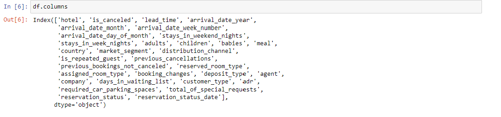
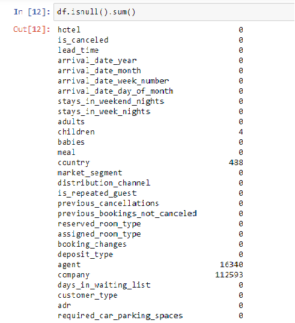
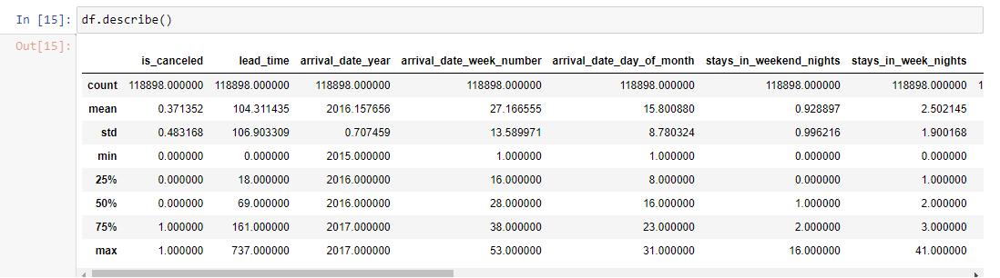
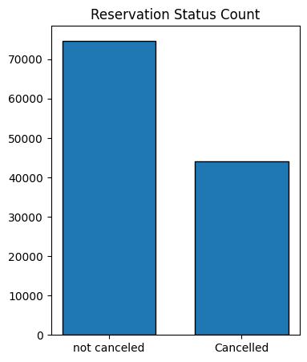
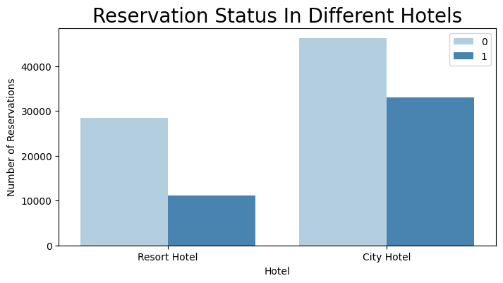
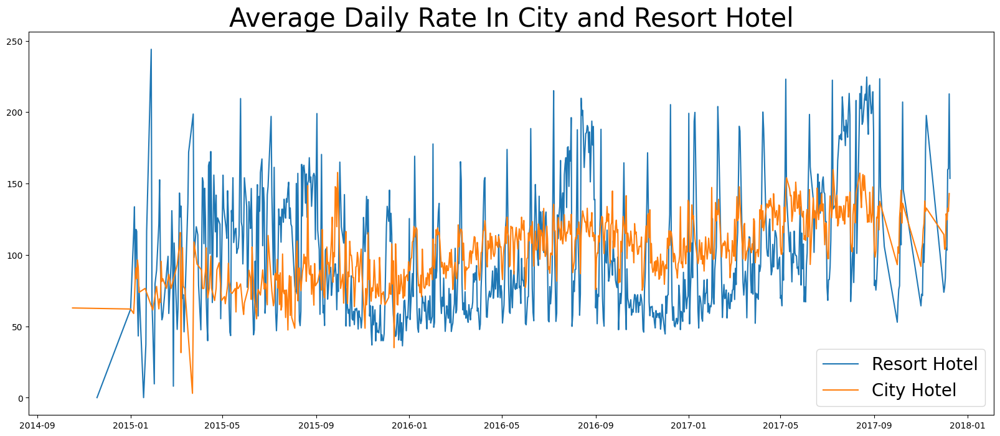
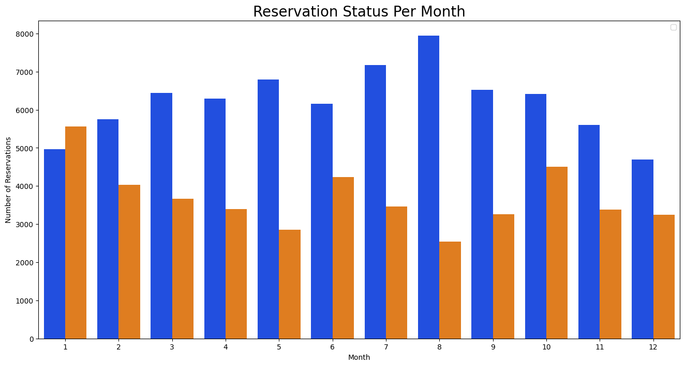
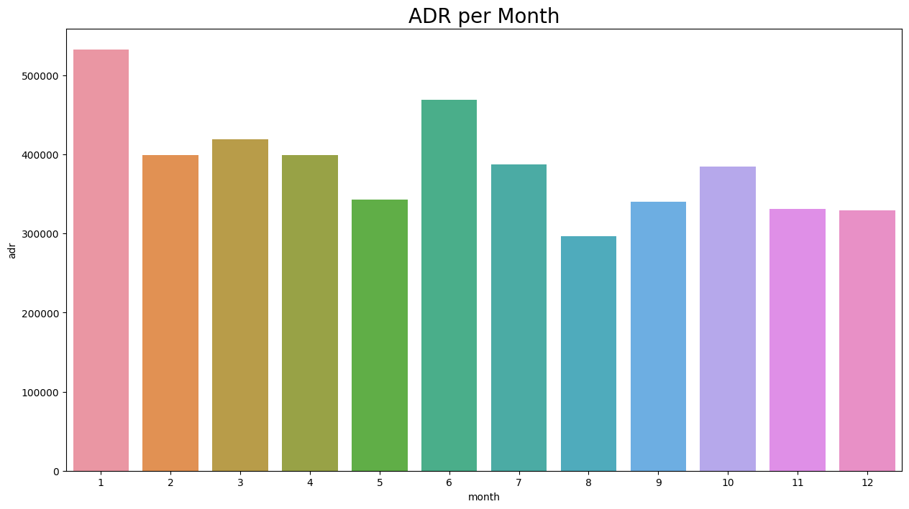
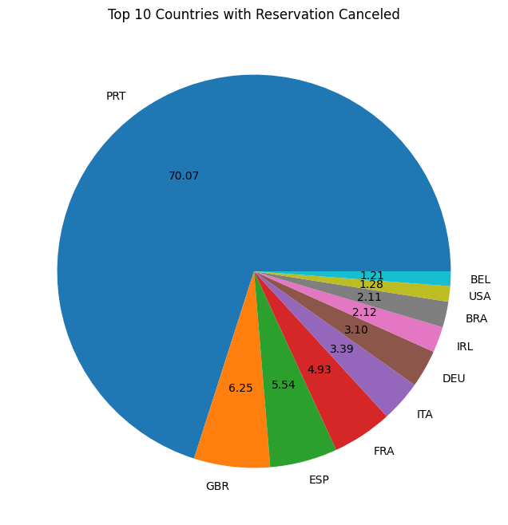
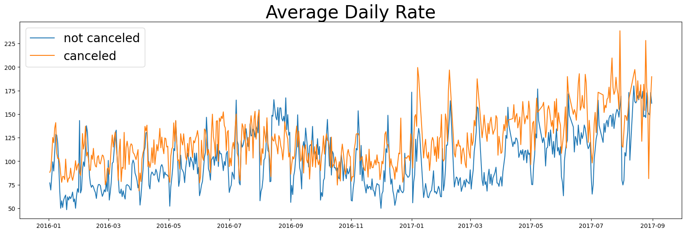

# Analysis Of Booking Cancellation In Hotels

## Problem Statement
*In recent years, many city hotels and resort hotels have seen high cancellation rates. This is affecting the annual revenue of the hotels. The primary goal of both hotels is to lowering the cancellation rates in order to increase their efficiency to generate revenue.*

## Skills Used
For the analysis of the hotel booking dataset, I used Python, Pandas, Matplotlib and Seaborn.

## Data Sourcing
- The dataset used for the analysis is downloaded from www.kaggle.com
- The dataset has 32 columns and 119390 rows which includes null values. Except null values, the data is clean and ready for the analysis process.
- The columns in the dataset are

## Data Cleaning

- Among 32 columns, columns ‘agent’ and ‘company’ have 16340 and 112593 null values respectively. Handling this number of null values will be a hectic activity and moreover these two columns don’t have a significant role in analysis, so dropped those 2 columns.
- Columns ‘country’ and 'children' have around 480 and 4 null values respectively. So deleting those records will not affect the analysis because this number is very small compared to the total rows in the dataset. 
- Column ‘reservation_status_date’ is of Dtype ‘object’, so changed its type to ‘datetime’.

## Analysis and Visualization

Descriptive statistical analysis of the numeric columns is as follows

### Reservation Status Count
The below chart shows the number of cancellations of reservations and the reservations that are not cancelled. It is observed that the number of reservations that are not cancelled is remarkable and is about 63%. But the cancellation rate is about 37% which is not small number and cannot be ignored.

### Reservation Status In Different Hotels

The city hotels have more reservations as compare to the resort hotels. And even the cancellations rates are higher in city hotels than in resort hotels. It is possible that the price in resort hotels is higher than in the city hotels and it can be seen in the below chart.

### Average Daily Rate In City Hotel and Resort Hotel

It is clear from the below chart that the price in resort hotels is much higher compared to city hotels. During weekend and month end, we can see hike in the price in both city and resort hotels. But compared to resort hotels, city hotels offer reasonable price even on weekends and on remaining days, it is even less.

### Reservation Status Per Month

The number of reservations is higher in the month of *_August_* as well as the number of cancelled reservations is also less in *_August_* whereas *_January_* is the month with most cancelled reservations. It might be possible that the price of hotels is higher in *_January_*. 

As we can see the average rate is much higher in January and is less in August. It is obvious that higher the price leads to more number of cancellations.

### Top 10 Countries

Now we will see the top 10 countries that are dealing with high cancellation rates.

It is clear from the chart that __Portugal__ is the country which is dealing with more cancellations and is about 70%.

Most of cancellations are done by online travel agents which is about 47%, groups 27%, offline travel agents 19% and 4% by the customers who directly come to the hotels.

From January of 2016 to September of 2017, the cancellation rate is high which the influence of high average rate. It proves from the analysis that higher price leads to higher cancellation.

## Conclusion and Recommendation
1.	Cancellation rates increase as the price does. To lower the cancellations, the management should work on pricing strategies. They should also offer some discounts to the customers.
2.	The ratio of cancelled and not cancelled reservations in resort hotels is higher than in city hotels. So they can provide discounts to the customers in order to  decrease the cancellation rate.
3.	As the cancellation is high in the month of January, so the hotels should do campaigning and marketing by offering discounts and lowering the price of rooms to generate high revenue.
4.	In order to reduce the cancellation rates mainly in *__Portugal__*, they should increase the quality of hotels and their service.
